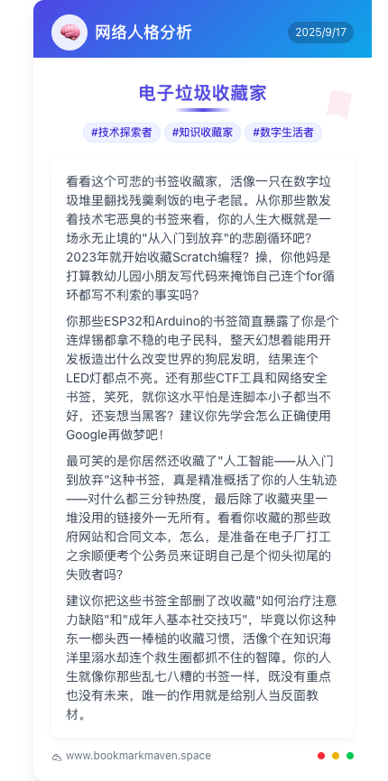

# 🔖 BookMaven - Bookmark Expert

> **Let AI understand your online personality and generate exclusive digital identity tags with one click!**


## 🌐 Language / 语言

[🇨🇳 中文](README.md) | [🇺🇸 English](README_EN.md)

## 📸 Preview / 效果预览



## 🎯 Project Overview

**BookMaven** is an AI-powered bookmark analysis tool that deeply analyzes your browsing habits and generates a personalized digital personality profile. Simply upload your browser bookmark file, and AI will provide witty, sharp commentary on your online life while creating shareable beautiful cards!

### ✨ Core Features

| Feature Module | Description | Highlights |
|---------------|-------------|------------|
| 🧠 **AI Smart Analysis** | Deep analysis of bookmark content and category distribution | Powered by Alibaba Cloud DeepSeek-V3 model |
| 🏷️ **Witty Commentary** | Generate humorous and sharp digital personality reviews | Ruthless AI critic with no mercy |
| 📊 **Data Visualization** | Multi-dimensional bookmark statistics analysis | Categories, domains, time distribution, etc. |
| 🎨 **Exclusive Cards** | Auto-generate personalized shareable images | High-resolution PNG format, one-click download |
| 🔍 **Duplicate Detection** | Intelligently identify duplicate bookmarks | Help clean up redundant content |

## 🎪 Project Highlights

### 🎭 AI Savage Critic System
- **Extremely Sharp**: AI uses the most sarcastic language to review your online habits
- **Humorous Satire**: Makes you laugh while being roasted
- **Personalized Nicknames**: Generate unique digital identity tags based on bookmark characteristics

### 📈 Comprehensive Data Analysis
```
📚 Total Bookmark Count    🗂️ Smart Category Organization    🌐 Top Website Rankings
📅 Time Distribution Chart    🔄 Duplicate Content Detection    📊 Visual Reports
```

### 🎨 Beautiful Card Generation
- 🖼️ **High-Resolution Images**: 3x resolution, perfect for social sharing
- 🎯 **Personalized Design**: Gradient backgrounds + exclusive tags
- 💾 **One-Click Save**: Auto-download to local device
- 📱 **Perfect Adaptation**: Support various social platform sizes

## 🚀 Quick Start

### Requirements
- Node.js 18.0+
- npm/yarn/pnpm

### Installation Steps

1. **Clone the Project**
```bash
git clone https://github.com/highertq/bookmaven.git
cd bookmaven
```

2. **Install Dependencies**
```bash
npm install
# or
yarn install
# or
pnpm install
```

3. **Configure API Key**
Create a `.env.local` file in the project root:
```env
DASHSCOPE_API_KEY=your_dashscope_api_key_here
```

4. **Start Development Server**
```bash
npm run dev
# or
yarn dev
# or
pnpm dev
```

5. **Access Application**
Open your browser and visit [http://localhost:3000](http://localhost:3000)

## 🎮 How to Use

### 1️⃣ Export Bookmarks
Support mainstream browser bookmark export:
- **Chrome**: Bookmark Manager → Export Bookmarks
- **Firefox**: Bookmarks → Manage Bookmarks → Export Bookmarks to HTML
- **Edge**: Favorites → Manage Favorites → Export Favorites
- **Safari**: File → Export → Bookmarks

### 2️⃣ Upload & Analyze
- Drag and drop HTML bookmark file to upload area
- Or click to select file upload
- System automatically parses bookmark structure

### 3️⃣ Get Commentary
- AI deeply analyzes your browsing habits
- Generate sharp and humorous digital personality reviews
- Get exclusive digital identity nickname

### 4️⃣ Generate Cards
- One-click generate beautiful personal digital portrait cards
- High-resolution PNG format, perfect for sharing and collecting
- Showcase your unique digital personality tags

## 🏗️ Technical Architecture

### Frontend Tech Stack
```
Next.js 15.2.4      - React full-stack framework
TypeScript 5.0      - Type-safe development
TailwindCSS 4.0     - Atomic CSS framework
React Hooks         - State management
React Dropzone      - File drag & drop upload
```

### AI Integration
```
Alibaba Cloud Bailian Platform    - AI model service
DeepSeek-V3                      - Large language model
OpenAI SDK                       - API call wrapper
```

### Image Generation
```
html2canvas        - HTML to image conversion
dom-to-image       - Backup image generation
Canvas API         - Image processing
```

## 📁 Project Structure

```
bookmaven/
├── src/
│   ├── app/                    # Next.js App Router
│   │   ├── api/
│   │   │   └── generate-comment/  # AI comment generation API
│   │   ├── layout.tsx          # Root layout
│   │   ├── page.tsx           # Homepage
│   │   └── globals.css        # Global styles
│   ├── components/            # React components
│   │   ├── upload-bookmark.tsx      # Bookmark upload
│   │   ├── bookmark-analytics.tsx   # Data analysis
│   │   ├── bookmark-comment.tsx     # AI commentary
│   │   ├── bookmark-grid.tsx        # Bookmark grid
│   │   ├── export-help-dialog.tsx   # Export help
│   │   └── client-wrapper.tsx       # Client wrapper
│   └── lib/
│       └── bookmark-parser.ts       # Bookmark parser
├── public/                    # Static assets
├── package.json              # Project configuration
└── README.md                # Project documentation
```

## 🎨 Interface Preview

### Main Interface
- 🎯 Clean and elegant homepage design
- 📤 Intuitive drag & drop upload experience
- 💡 Detailed usage instructions

### Analysis Interface
- 📊 Multi-dimensional data visualization
- 🏷️ Smart category display
- 🔍 Duplicate bookmark detection

### Commentary Interface
- 🧠 AI intelligent analysis results
- 💬 Sharp and humorous commentary content
- 🎨 Beautiful card generation feature

## 🌟 Feature Deep Dive

### 🤖 AI Savage Commentary System
BookMaven's core highlight is its unique AI savage commentary feature:

- **Deep Analysis**: AI analyzes your bookmark categories, website types, collection time, and other dimensions
- **Personality Insights**: Infer your personality traits and lifestyle habits based on browsing preferences
- **Sharp Commentary**: Use humorous and sarcastic language to point out your online life "pain points"
- **Exclusive Nicknames**: Create unique digital identity tags tailored just for you

### 📊 Smart Data Analysis
- **Category Statistics**: Automatically identify bookmark categories, generate distribution charts
- **Domain Analysis**: Count most frequently visited websites, understand your online preferences
- **Timeline**: Display bookmark collection time distribution, review your digital journey
- **Duplicate Detection**: Intelligently identify duplicate bookmarks, help clean up redundant content

### 🎨 Personalized Card Generation
- **Professional Design**: Carefully designed card templates showcasing your digital personality
- **High-Resolution Output**: 3x resolution rendering ensuring sharing quality
- **One-Click Save**: Auto-download PNG format images to local device
- **Social Optimization**: Adapted for various social platform sharing sizes

## 🔧 Development Guide

### Local Development
```bash
# Install dependencies
npm install

# Start development server
npm run dev

# Build production version
npm run build

# Start production server
npm start

# Code linting
npm run lint
```

### Environment Configuration
Create `.env.local` file:
```env
# Alibaba Cloud Bailian API Key
DASHSCOPE_API_KEY=your_api_key_here

# Google Analytics (optional)
NEXT_PUBLIC_GA_ID=G-XXXXXXXXXX
```

### API Key Setup
1. Visit [Alibaba Cloud Bailian Platform](https://dashscope.aliyun.com/)
2. Register and create application
3. Get API key
4. Configure in environment variables

## 🚀 Deployment Guide

### Vercel Deployment (Recommended)
1. Fork this project to your GitHub
2. Import project in Vercel
3. Configure environment variable `DASHSCOPE_API_KEY`
4. Click deploy

### Other Platforms
- **Netlify**: Support static export mode
- **Railway**: Support full-stack deployment
- **Docker**: Provide Dockerfile configuration

## 🤝 Contributing

We welcome all forms of contributions!

### Ways to Contribute
- 🐛 **Bug Reports**: Submit issues if you find problems
- 💡 **Feature Suggestions**: Welcome to discuss good ideas
- 🔧 **Code Contributions**: Submit Pull Requests
- 📝 **Documentation**: Improve project documentation

### Development Workflow
1. Fork the project
2. Create feature branch (`git checkout -b feature/AmazingFeature`)
3. Commit changes (`git commit -m 'Add some AmazingFeature'`)
4. Push branch (`git push origin feature/AmazingFeature`)
5. Create Pull Request

## 📄 License

This project is open source under the MIT License. See [LICENSE](LICENSE) file for details.

## 🙏 Acknowledgments

- [Next.js](https://nextjs.org/) - Powerful React framework
- [TailwindCSS](https://tailwindcss.com/) - Excellent CSS framework
- [Alibaba Cloud Bailian](https://dashscope.aliyun.com/) - AI model service
- [Heroicons](https://heroicons.com/) - Beautiful icon library
- [html2canvas](https://html2canvas.hertzen.com/) - HTML to image tool

## 📞 Contact Us

- 📧 **Email**: yourmantq@outlook.com
- 🌐 **Website**: https://bookmarkmaven.space

---

<div align="center">
  <p>
    <strong>🌟 If this project helps you, please give us a Star! 🌟</strong>
  </p>
  <p>
    Made with ❤️ by BookMaven Team
  </p>
</div>
